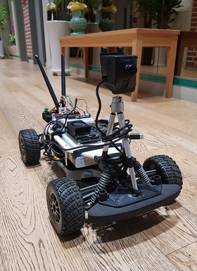
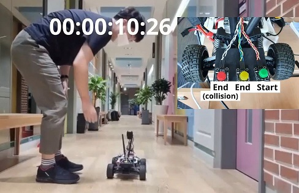

# 강화학습을 이용한 자율주행 구현

## 최종 결과 영상
> https://drive.google.com/file/d/1a1pGEO-CO3FDoFukODsCr2UXRjlBTGJ4/view?usp=sharing
 

## 개발 배경

> https://www.youtube.com/watch?v=eRwTbRtnT1I
>
> 강화학습을 이용하여 단시간 학습을 통해 자율주행 구현

## 프로젝트 요구사항 & 목표

> 프로젝트 요구사항
>
> 1. 모형차가 주행가능 영역을 실시간으로 인지
> 2. DDPG 강화학습 모델이 단시간(10분) 내에 학습할 수 있도록 최적 Reward 식 설계
> 3. 하이퍼파라미터의 수정을 통한 최적의 학습 조건 도출
>
> 프로젝트 목표
>
> 1. 실시간 영역분할(Image Segmentation) 모델을 적용한다
> 2. 최적의 Reward를 설계하기 위해 시뮬레이터를 이용하고 모형차에 적용한다.
> 3. 시뮬레이터에서 최적의 강화학습 조건을 찾는다.

## 시스템 구성

> 인지 : 영역분할  segmentation ( ENET - sad )
>
> 판단, 제어 : 강화학습 Reinforcelearning ( DDPG )

### 시뮬레이터

### 모형차

## 프로젝트 결과

### Carla simulator

.gif)

### NX

.gif)

> 1. Enet-Sad 모델을 통해 FPS 10의 실시간 영역분할 모델 적용 성공
>
> 2. 모형차에서 10분 (60 Episode) 만에 강화학습 주행 성공 
>
> 3. Gazebo, Carla 시뮬레이터에서 강화학습 적용을 통해 Reward의 최적 하이퍼 파라미터 추출 성공 (⍺=10, 𝛽=50)

## 프로젝트 ref

### Theory

> segmentation
>
> - ENET - SAD 
>
> https://arxiv.org/pdf/1908.00821.pdf
>
> 
>
> reinforcelearning
>
> - DDPG
>
> https://arxiv.org/pdf/1509.02971.pdf?source=post_page---------------------------
>
> - DDPG ( autonomus driving  )
>
> https://arxiv.org/pdf/1811.11329.pdf
>
> 

### NX

> NX board source
>
> NVIDIA NX 
>
> https://www.nvidia.com/ko-kr/autonomous-machines/embedded-systems/jetson-xavier-nx/
>
> f1tenth 기반 RC카
>
>  https://f1tenth.org/
>
> OS : ROS_melodic , Linux

### SIMULATOR

> Carla Simulator 0.9.10.1
>
> https://carla.readthedocs.io/en/latest/start_quickstart/
>
> OS : ROS_melodic  , Linux
